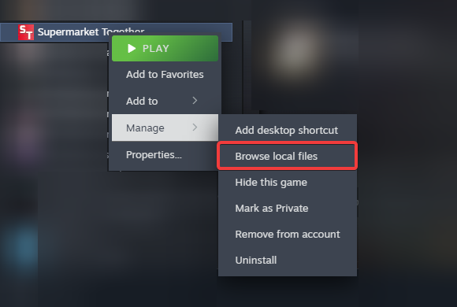
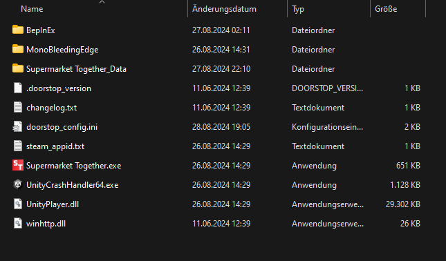

# HTogether

A Mod for [Supermarket Together](https://store.steampowered.com/app/2709570/Supermarket_Together/).

## **DISCLAIMER**
**This software is for testing/educational purposes only. We do not encourage using it when you're not allowed, and will not bear liability for your actions.**

## Installation
1. Download [BepInEx 5 x64](https://github.com/BepInEx/BepInEx/releases/download/v5.4.23.2/BepInEx_win_x64_5.4.23.2.zip).
2. Download [HTogether.zip](https://github.com/CodeName-Anti/HTogether/releases/latest/download/HTogether.zip).
3. Extract the BepInEx Zip archive in your Supermarket Together Installation Folder(Steam -> Right Click Supermarket Together -> Manage -> Browse local Files).  

      
    Your Supermarkt Together Installation Folder should look like this:
    

4. **Start the Game** and then **close it** once you are in the Main Menu.
5. Create a new Folder in "/BepInEx/plugins" (Will load after step 4) and name it "HTogether", then extract the [HTogether.zip](https://github.com/CodeName-Anti/HTogether/releases/latest/download/HTogether.zip) into it.

## Features

- Add/Remove money
- Add Franchise experience or points
- Edit box spawning delay
- Disable box collisions with each other
- Set item amount in box

## Building
1. Clone this repo `git clone --recursive https://github.com/CodeName-Anti/HTogether.git`
2. Open the HTogether folder inside the cloned repo.
3. Create a copy of `HTogether.csproj.user.example` and rename it to `HTogether.csproj.user`
4. Open `HTogether.csproj.user` with a text editor of your choice and change the Supermarket Together install directory.
4. Open `HTogether.sln`.
